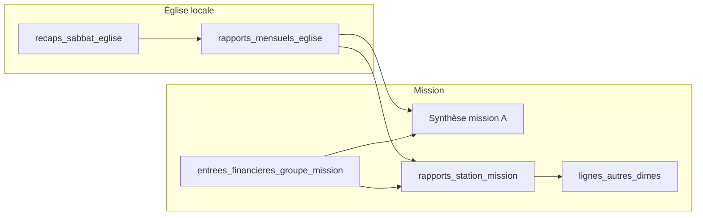

# Schéma de données — Mission / églises locales / finances

Les **tables et colonnes** sont nommées en **français** (convention `snake_case`). Les modèles Eloquent pourront utiliser `$table` si vous préférez des noms de classe en anglais.

## Vue d’ensemble (flux)

## Tables principales

| Table | Rôle |
|--------|------|
| `missions` | Mission (V1 : une ligne). Colonnes : `nom`, `nom_court`. |
| `districts` | Districts. `nom`, `mission_id`. |
| `eglises_locales` | Église locale ; `code_unique` ; `actif`. |
| `groupes_mission` | Groupe rattaché à la mission ; `code_unique`. |

### Utilisateurs (`users`)

| Colonne | Rôle |
|---------|------|
| `mission_id` | Compte mission. |
| `eglise_locale_id` | Compte église (saisie locale uniquement). |
| `role` | Rôle métier. |
| `identifiant_public` | UUID pour sync offline. |

### `membres`

Rattaché soit à `eglise_locale_id`, soit à `groupe_mission_id`. Champs : `nom`, `prenom`, `sexe`, `date_naissance`, `lieu_naissance`, `noms_pere`, `noms_mere`, `adresses`, `telephone`, `niveau_etudes`, `occupation`, `situation_matrimoniale`, `date_mariage`, `conjoint`, `date_bapteme`, `lieu_bapteme`, `religion_anterieure`, `recu_dans_eglise_de`, `recu_le`, `baptise_par`, `observations`, `identifiant_public`.

### Finances — église locale

| Table | Rôle |
|--------|------|
| `recaps_sabbat_eglise` | Récap par église et `date_sabbat` ; signatures ; `statut`. |
| `lignes_dime_offrande_recap` | Lignes membre / `nom_visiteur` ; `dimes`, `offrandes`. |
| `ventilation_offrandes_recap` | Ventilation EDS / enveloppes / culte / construction (1:1 recap). |
| `rapports_mensuels_eglise` | Un par (église, `annee`, `mois`), dérivé des récaps. |
| `rapports_mensuels_lignes_sabbat` | Jusqu’à 5 sabbats ; montants du formulaire mensuel. |
| `lignes_synthese_mensuelle_eglise` | Grille type **rapport de synthèse mission** : par sabbat (`indice_sabbat` 1–5) + ligne **total** (`indice_sabbat` = 0) ; colonnes `dimes`, `offrande_ecole_sabbat`, `budget_eglise_locale`, `fonds_missionnaires`, `autres_offrandes`, `montant_total`. |
| `aggregats_synthese_mission_mensuelle` | **Une ligne par mission / mois** : somme des églises + des groupes (à remplir par le service métier), pour PDF synthèse sans tout recalculer à la volée. |

Sur `rapports_mensuels_eglise` : `etabli_a`, `etabli_le` (équivalent « Fait à … le … » sur le formulaire mensuel).

### Finances — groupes mission (allégé)

| Table | Rôle |
|--------|------|
| `entrees_financieres_groupe_mission` | Par groupe et mois : `dimes`, `offrande_ecole_sabbat`, etc. Les montants des groupes sont **agrégés dans** `aggregats_synthese_mission_mensuelle` (pas de sous-table de lignes sabbat, version allégée). |

### Rapport station (document B)

| Table | Rôle |
|--------|------|
| `rapports_station_mission` | Par mission et période. |
| `lignes_rapport_station_mission` | `code_ligne`, `pourcentage`, `montant_mois`, cumuls. |
| `lignes_autres_dimes` | Détail « autres dîmes ». |
| `regles_repartition_mission` | Paramètres de % (`libelle_fr`, `s_applique_a`, `pourcentage`, …). |

## Sync

- `identifiant_public` (UUID) sur les entités à synchroniser hors ligne.
- `code_unique` sur `eglises_locales` et `groupes_mission` pour le périmètre client.

## Base existante

Si d’anciennes migrations anglaises ont déjà été exécutées : `php artisan migrate:fresh` (efface les données) puis `php artisan migrate`.
